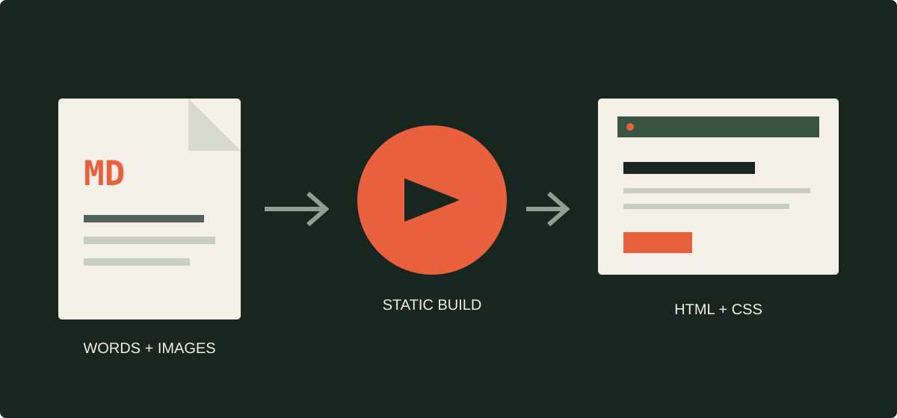

Every site starts the same way: an empty file, a blinking cursor, and too many possible directions. This one starts with a deliberately simple promise.

> Write in Markdown. Keep the work in Git. Let the build system handle everything else.

There is no dashboard to learn and no database to maintain. An article is a file you can open in any text editor, review in a pull request, and recover from the repository's history.

## Publishing the next article

Create a Markdown file inside `src/content/articles`. Give it a short, URL-friendly filename such as `my-new-article.md`, then add frontmatter at the top:

```md
---
title: "My new article"
description: "A one-sentence summary used on article cards and by search engines."
pubDate: 2026-09-08
author: "Your name"
tags:
  - Design
  - Notes
cover: "./my-new-article-cover.jpg"
coverAlt: "A useful description of the cover image"
draft: false
---

Start writing here.
```

The build validates those fields. A missing title, invalid date, or misspelled image path fails the build instead of publishing a broken page.

## Images belong with the words

Put image files next to the article and reference them with normal Markdown. Local images are processed by Astro during the static build, including dimensions and optimization where the format supports it.



```md

```

The `cover` field uses the same relative-file approach. Always include useful alternative text unless the image is purely decorative.

## Draft, commit, publish

Set `draft: true` while an article is in progress. Drafts remain visible during local development but are left out of production builds.

When the article is ready, change that value to `false`, commit the files, and push to `main`. GitHub Actions compiles the entire site ahead of time and deploys the generated HTML, CSS, and images to GitHub Pages.

That is the whole publishing loop. The machinery stays quiet so the writing can take up the space.
